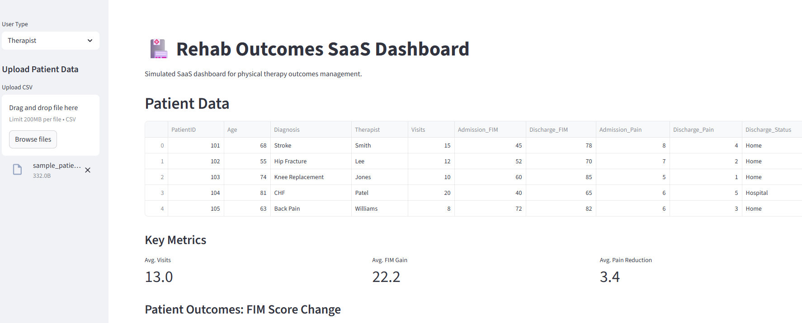
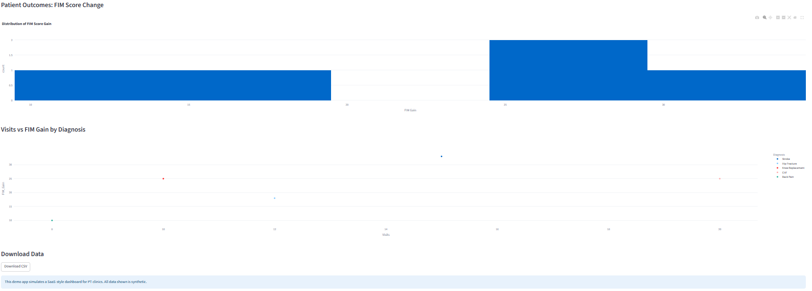

# 🏥 Rehab Outcomes SaaS Dashboard

---

> **A cloud-ready, SaaS-style dashboard for physical therapy clinics to upload, analyze, and visualize anonymized patient outcomes — built with Python and Streamlit.**

---

## 🚀 Live Demo

🔗 [**View App on Streamlit Cloud**](YOUR-STREAMLIT-CLOUD-LINK-HERE)  
*(Deploy on [Streamlit Cloud](https://streamlit.io/cloud) and add your link here!)*

---

## 📸 Screenshots

### Main Dashboard View

### Metrics & Analytics

---

---

## 🧑‍💻 Features

- 📤 Upload or use sample anonymized patient data (CSV)
- 📊 Interactive analytics: FIM gain, visits, pain reduction, outcome trends
- 🩺 View patient cohorts by diagnosis, therapist, or status
- 👥 User roles: Therapist/Admin (simulated)
- 📈 Downloadable reports (CSV)
- 🌐 Modern UI, cloud deployable (Streamlit)
- 🔒 All sample data is **synthetic** (privacy safe)

---

## 📁 Project Structure

